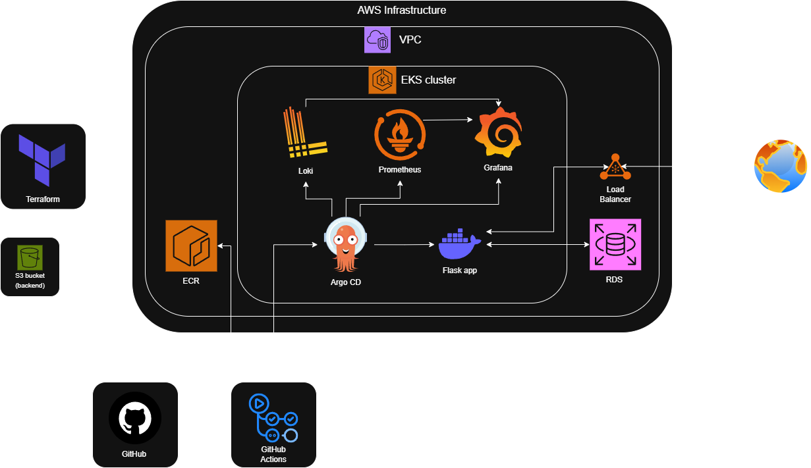
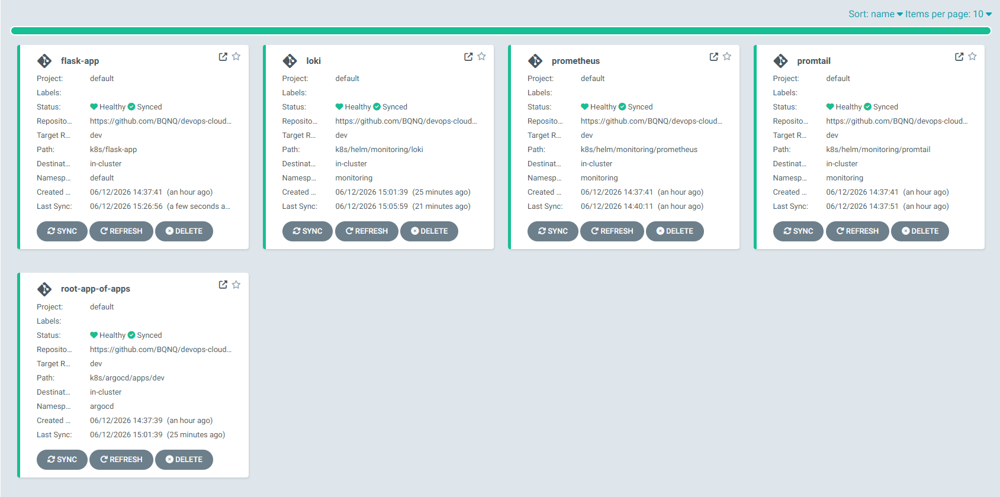
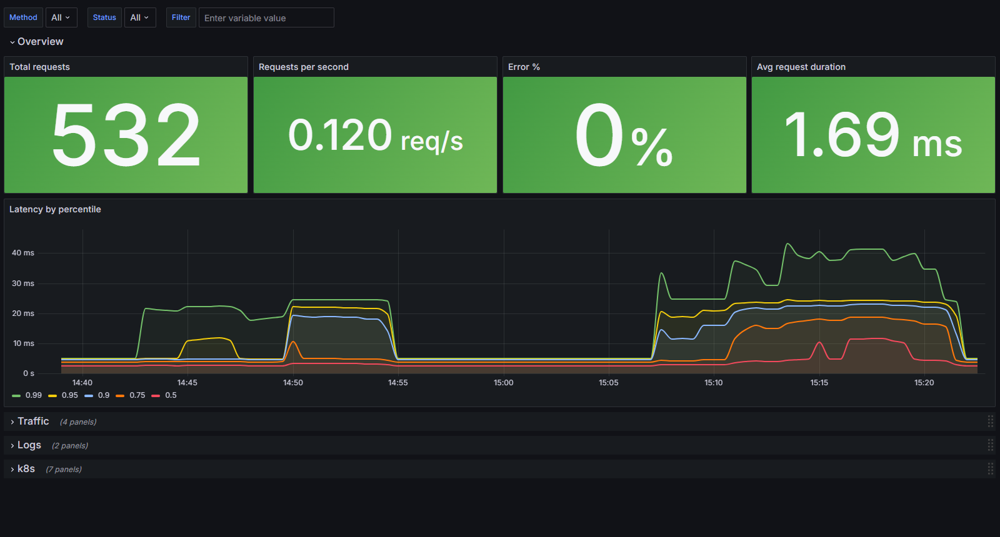
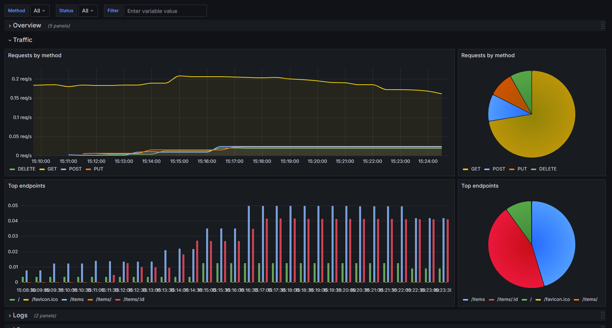
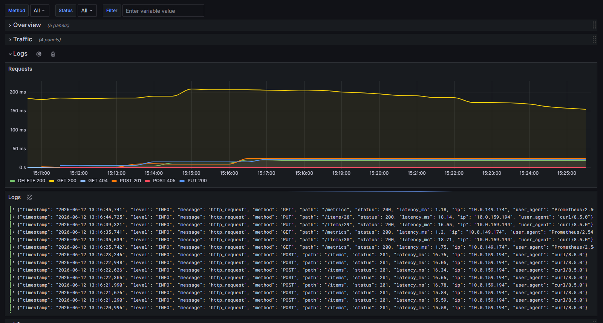
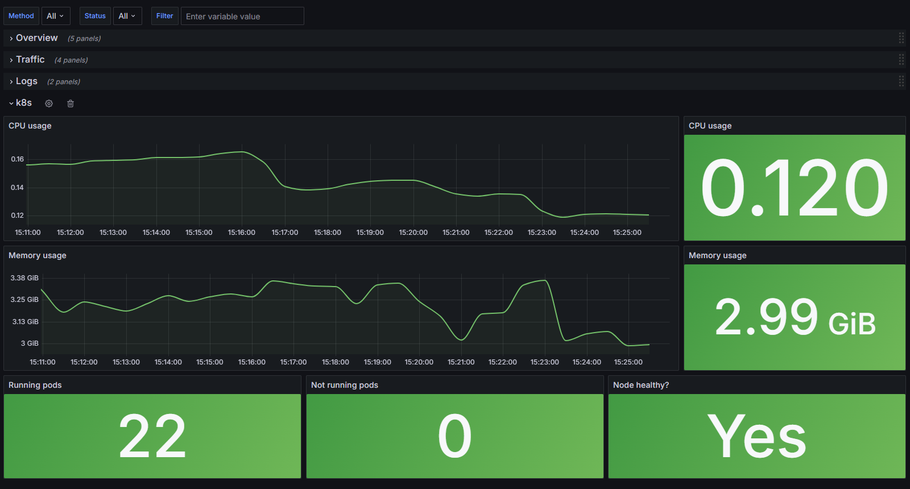

# Devops cloud platform

A cloud-native GitOps platform built on AWS using Terraform, Kubernetes (EKS), Argo CD, and CI/CD pipelines with GitHub Actions.

The project demonstrates a full software delivery lifecycle in a cloud environment with simple flask API exmaple.

## Architecture


## Tech Stack

The project is built using the following technologies:

| Layer                 | Technology                        |
|-----------------------|-----------------------------------|
| Cloud                 | AWS (EKS, ECR, S3, IAM, VPC, RDS) |
| Infrastructure as Code| Terraform                         |
| Containers            | Docker                            |
| CI/CD                 | GitHub Actions                    |
| GitOps                | Argo CD                           |
| Observability         | Prometheus, Grafana, Loki         |

## CI/CD Workflow

The project has two main workflows: development and pull request flow.

### Development
On push to `dev` branch
- Docker image build
- Local healthcheck and trivy scan
- Image push to ECR
- K8s manifest update and commit
- Argo CD deploys the changes to the `dev environment`

### Pull Request
When a pull request is created to `main`
- Docker image build
- Local healthcheck and trivy scan
- Image push to ECR
- **No deployment**

### After merge to main
- K8s manifest update and commit
- Argo CD deploys the changes to the `prod environment`

## GitOps (Argo CD)

Argo CD continuously monitors Kubernetes manifests and Helm values in Git and ensures cluster state matches the repository.



## Observability
- Prometheus – metrics
- Loki – logs
- Grafana – dashboards

|**Overview**  |**Traffic** |
|-----------------------------------------------------------|-------------------------------------------------------|
|**Logs**          |**K8s**        |

## Repository Structure
```text
devops-cloud-platform/
├── app/                # Flask app and Dockerfile etc.
├── docs/               # Architecture diagram and screenshots
├── k8s
│   ├── argocd          # Argo CD Applications and config
│   ├── bootstrap       # App of apps and initDB job
│   ├── flask-app       # App manifests
│   ├── grafana         # Grafana dashboard
│   └── helm
│       └── monitoring  # Loki, prometheus and promtail config
└── terraform
    ├── backend         # Bootstrap for s3 backend
    └── modules         # EKS, ECR, VPC and RDS modules
